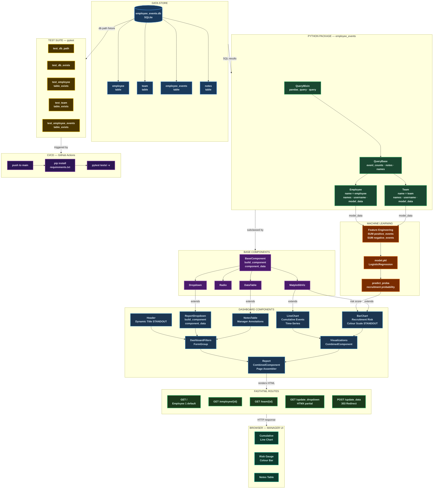
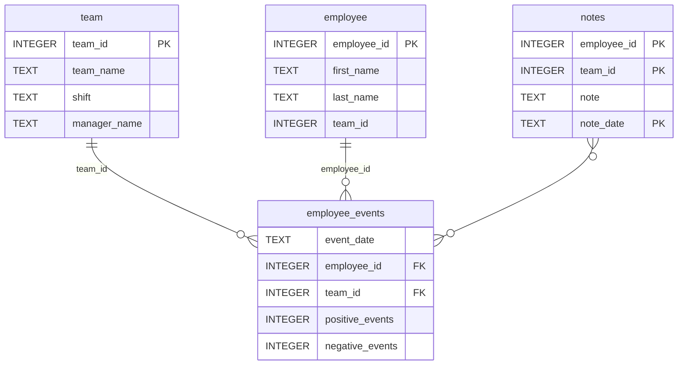

# Employee Performance & Recruitment Risk Dashboard

> **Software Engineering for Data Scientists**

[](https://python.org)
[](https://docs.fastht.ml/)
[](https://scikit-learn.org)
[](https://sqlite.org)
[](https://pytest.org)
[](https://github.com/YOUR_USERNAME/workforce-risk-performance-dashboard/actions/workflows/tests.yml)
[](LICENSE.txt)

---

## Table of Contents

- [Business Context](#business-context)
- [Project Overview](#project-overview)
- [Features](#features)
- [Architecture](#architecture)
- [Repository Structure](#repository-structure)
- [Database Schema](#database-schema)
- [Python Package](#python-package-employee_events)
- [Dashboard](#dashboard)
- [Machine Learning Model](#machine-learning-model)
- [Getting Started](#getting-started)
- [Running the Dashboard](#running-the-dashboard)
- [Running Tests](#running-tests)
- [CI/CD Pipeline](#cicd-pipeline)
- [Standout Enhancements](#standout-enhancements)
- [API Reference](#api-reference)
- [Technologies](#technologies)
- [Contributing](#contributing)
- [Authors & Acknowledgements](#authors--acknowledgements)

---

## Business Context

A manufacturing company's upper management identified a growing concern: **top-performing employees were being recruited away by competitors**. To address this, the data team:

1. Deployed a **structured data-entry form** allowing managers to log positive and negative employee performance events
2. Created the **`employee_events` database** to store these records
3. Trained a **machine learning model** to predict each employee's likelihood of being recruited
4. Assigned the task of building a **real-time monitoring dashboard** to surface performance trends and risk scores to managers

This project delivers that dashboard — a full-stack data product built with Python, FastHTML, and scikit-learn.

---

## Project Overview

This project is a **complete data science and software engineering solution** spanning:

| Layer | What Was Built |
|---|---|
| **Data Access** | Installable Python package (`employee_events`) with a typed SQL query API |
| **Machine Learning** | Runtime inference pipeline using a pre-trained logistic regression model |
| **Web Dashboard** | FastHTML server-side web app with two Matplotlib visualisations |
| **Testing** | pytest fixture-based test suite with 5 passing tests |
| **CI/CD** | Three GitHub Actions workflows that auto-run on every push to `main` |

---

## Features

- **Employee and Team Views** — toggle between individual employee and team-level analysis
- **Cumulative Event Time-Series** — track positive vs negative performance events over time
- **ML Recruitment Risk Score** — logistic regression model predicts likelihood of an employee leaving
- **Colour-Coded Risk Gauge** — green to amber to red colour scale for instant risk interpretation *(standout)*
- **Dynamic Page Title** — automatically switches between "Employee Performance" and "Team Performance" *(standout)*
- **Managerial Notes Table** — qualitative annotations displayed alongside quantitative metrics
- **HTMX Partial Updates** — dropdown refreshes without a full page reload
- **Bookmarkable URLs** — every employee and team view has a unique, shareable URL

---

## Architecture

### Data Science Flow



### Layer Summary

| Layer | Technology | Responsibility |
|---|---|---|
| **Data Store** | SQLite (`employee_events.db`) | Persistent relational storage; four tables |
| **Python Package** | `employee_events` (pip-installable) | Typed SQL query API — DataFrames and tuple lists |
| **Machine Learning** | scikit-learn `LogisticRegression` | Runtime recruitment risk probability scoring |
| **Base Components** | FastHTML + Matplotlib | Reusable atomic UI building blocks |
| **Dashboard Components** | OOP subclasses | Page assembly via `CombinedComponent` |
| **Routes** | FastHTML ASGI server | HTTP routing + HTMX partial updates |
| **Testing** | pytest fixtures | Database integrity validation (5 tests) |
| **CI/CD** | GitHub Actions (3 workflows) | Auto-run tests and linting on every push to `main` |

---

## Repository Structure

```
workforce-risk-performance-dashboard/
├── .github/
│   └── workflows/
│       ├── test.yml                # CI: original Udacity test workflow
│       ├── tests.yml               # CI: run pytest via requirements.txt
│       └── lint.yml                # CI: flake8 linting on push to main
│
├── assets/
│   ├── model.pkl                   # Pre-trained LogisticRegression model
│   └── report.css                  # Dashboard stylesheet
│
├── python-package/
│   ├── employee_events/
│   │   ├── __init__.py             # Exports Employee, Team, QueryBase
│   │   ├── sql_execution.py        # QueryMixin + db_path + query decorator
│   │   ├── query_base.py           # QueryBase: event_counts, notes, names
│   │   ├── employee.py             # Employee subclass + SQL queries 3 & 4
│   │   ├── team.py                 # Team subclass + SQL queries 5 & 6
│   │   ├── employee_events.db      # SQLite database (bundled in package)
│   │   └── requirements.txt        # Package-level dependencies
│   └── setup.py                    # Package build config; creates dist/ .tar.gz
│
├── report/
│   ├── base_components/
│   │   ├── __init__.py
│   │   ├── base_component.py       # BaseComponent abstract class
│   │   ├── dropdown.py             # Dropdown component
│   │   ├── radio.py                # Radio button component
│   │   ├── matplotlib_viz.py       # MatplotlibViz + base64 PNG encoding
│   │   └── data_table.py           # DataTable component
│   ├── combined_components/
│   │   ├── __init__.py
│   │   ├── combined_component.py   # CombinedComponent page assembler
│   │   └── form_group.py           # FormGroup with submit button
│   ├── dashboard.py                # Main app: all subclasses + routes
│   └── utils.py                    # load_model() + pathlib path variables
│
├── tests/
│   └── test_employee_events.py     # pytest: 5 database integrity tests
│
├── requirements.txt                # All dependencies (includes ./python-package)
└── README.md                       # This file
```

---

## Database Schema

The `employee_events.db` SQLite database contains four related tables:

### employee_events.db



---

## Python Package: `employee_events`

The `employee_events` package provides a clean, documented API for querying the database. Any data team can install it and access all datasets without writing raw SQL.


### Inheritance Tree

```
QueryMixin                  <- handles DB connection open / execute / close
    └── QueryBase           <- shared queries: event_counts(), notes(), names()
            ├── Employee    name="employee" — employee-specific SQL
            └── Team        name="team"     — team-specific SQL
```

### Key Methods

| Method | Returns | Description |
|---|---|---|
| `Employee().names()` | `list[tuple]` | All employees as `(full_name, employee_id)` |
| `Employee().username(id)` | `list[tuple]` | Full name for a specific employee ID |
| `Employee().event_counts(id)` | `DataFrame` | Daily +/- event counts for time-series chart |
| `Employee().model_data(id)` | `DataFrame` | Aggregated features for ML model inference |
| `Employee().notes(id)` | `DataFrame` | Manager notes with `note_date` and `note` |
| `Team().names()` | `list[tuple]` | All teams as `(team_name, team_id)` |
| `Team().model_data(id)` | `DataFrame` | Per-employee event totals for team risk score |

### Usage Example

```python
from employee_events import Employee, Team

# Get all employees
emp = Employee()
print(emp.names())
# [('Alex Martinez', 1), ('Brittany Williams', 2), ...]

# Get cumulative event data for employee 1
df = emp.event_counts(1)
print(df.head())
#    event_date  positive_events  negative_events
# 0  2023-10-23               4                1
# 1  2023-10-24               2                1

# Get recruitment risk features for a team
team = Team()
features = team.model_data(2)
print(features)
#    positive_events  negative_events
# 0              651              410
# 1              649              462
```

---

## Dashboard

The dashboard is a FastHTML server-side web application with the following URL routes:

| Route | View | Description |
|---|---|---|
| `GET /` | Default | Employee #1 view on first load |
| `GET /employee/{id}` | Employee | Performance + risk for a single employee |
| `GET /team/{id}` | Team | Aggregate performance + mean risk for a team |
| `GET /update_dropdown` | HTMX partial | Refreshes dropdown when radio button changes |
| `POST /update_data` | Redirect | Form submit — 303 redirect to entity URL |

### Component Hierarchy

```
Report (CombinedComponent)
├── Header                  ->  "Employee Performance" or "Team Performance" (standout)
├── DashboardFilters
│   ├── Radio               ->  [Employee | Team] toggle
│   └── ReportDropdown      ->  Entity selector populated from DB
├── Visualizations
│   ├── LineChart           ->  Cumulative events time-series (Matplotlib)
│   └── BarChart            ->  Recruitment risk gauge with colour scale (standout)
└── NotesTable              ->  Manager annotations from notes table
```

---

## Machine Learning Model

A **Logistic Regression** classifier (`assets/model.pkl`) was pre-trained on historical `employee_events` data.

**Feature Engineering:**

```sql
-- Employee: two scalar aggregate features
SELECT SUM(positive_events), SUM(negative_events)
FROM employee JOIN employee_events USING(employee_id)
WHERE employee_id = {id}

-- Team: one row per team member, same two features
SELECT SUM(positive_events), SUM(negative_events)
FROM team JOIN employee_events USING(team_id)
WHERE team_id = {id}
GROUP BY employee_id
```

**Inference:**

```python
probas = predictor.predict_proba(model_data)   # shape: (n_samples, 2)
risk   = probas[:, 1]                          # P(recruited)

# Employee: single probability
pred = risk[0]

# Team: mean probability across all members
pred = risk.mean()
```

---

## Getting Started

### Prerequisites

- Python 3.10+
- pip
- Git

### 1. Fork and clone the repository

Fork the repository from GitHub, then clone your fork:

```bash
git clone https://github.com/YOUR_USERNAME/workforce-risk-performance-dashboard.git
cd workforce-risk-performance-dashboard
```

> Replace `YOUR_USERNAME` with your actual GitHub username.

### 2. Create and activate a virtual environment

```bash
python -m venv env
source env/bin/activate        # macOS / Linux
env\Scripts\activate           # Windows
```

### 3. Install all dependencies

```bash
pip install -r requirements.txt
```

> `requirements.txt` includes `./python-package`, which installs the `employee_events` package directly from source with its bundled SQLite database.

### 4. Verify the package installed correctly

```python
from employee_events import Employee, Team
print(Employee().names()[:3])
# [('Alex Martinez', 1), ('Brittany Williams', 2), ('Calvin Chen', 3)]
```

---

## Running the Dashboard

> **Important:** You must `cd` into the `report/` directory before running. The dashboard uses a relative path to load `../assets/report.css` and will raise a `FileNotFoundError` if run from the project root.

```bash
cd report
python dashboard.py
```

The server starts on `http://localhost:5001` by default. Open your browser and navigate to:

| URL | What you see |
|---|---|
| `http://localhost:5001/` | Employee #1 dashboard (default) |
| `http://localhost:5001/employee/2` | Employee #2 — Brittany Williams |
| `http://localhost:5001/team/1` | Alpha Team aggregate view |

Use the **radio buttons** to toggle between Employee and Team mode, select an entity from the **dropdown**, then click **Submit**.

---

## Running Tests

```bash
# From the project root
pytest tests/ -v
```

**Expected output:**

```
============================= test session starts ==============================
collected 5 items

tests/test_employee_events.py::test_db_path                         PASSED [ 20%]
tests/test_employee_events.py::test_db_exists                       PASSED [ 40%]
tests/test_employee_events.py::test_employee_table_exists           PASSED [ 60%]
tests/test_employee_events.py::test_team_table_exists               PASSED [ 80%]
tests/test_employee_events.py::test_employee_events_table_exists    PASSED [100%]

============================== 5 passed in 0.07s ==============================
```

### Test Coverage

| Test | Fixture | Assertion |
|---|---|---|
| `test_db_path` | `db_path` | Path suffix is `.db` and filename is `employee_events.db` |
| `test_db_exists` | `db_path` | `employee_events.db` file exists on disk |
| `test_employee_table_exists` | `table_names` | `employee` table present in schema |
| `test_team_table_exists` | `table_names` | `team` table present in schema |
| `test_employee_events_table_exists` | `table_names` | `employee_events` table present in schema |

---

## CI/CD Pipeline

The repository ships with **three GitHub Actions workflows** that trigger automatically on every push and pull request to `main`:

| Workflow file | Name | What it runs |
|---|---|---|
| `.github/workflows/tests.yml` | Run Tests | Installs `requirements.txt`, runs `pytest tests/ -v` |
| `.github/workflows/test.yml` | Tests | Builds package with `setup.py sdist`, runs `pytest` |
| `.github/workflows/lint.yml` | Lint | Runs `flake8` to check code style |

All three workflows are inherited automatically when you fork the Udacity starter repository — no manual setup is required.

**tests.yml trigger:**

```yaml
on:
  push:
    branches: [ main ]
  pull_request:
    branches: [ main ]
```

**Pipeline steps (tests.yml):**
1. Checkout repository
2. Set up Python 3.11
3. `pip install -r requirements.txt`
4. `pytest tests/ -v`

---

## Standout Enhancements

### 1. Colour-Coded Recruitment Risk Scale

The `BarChart` visualisation maps a continuous `LinearSegmentedColormap` over the predicted probability, giving managers an immediate visual signal without needing to interpret a numeric axis:

```python
import matplotlib.colors as mcolors

cmap = mcolors.LinearSegmentedColormap.from_list(
    'risk', ['#2ecc71', '#f39c12', '#e74c3c']   # green -> amber -> red
)
bar_color = cmap(pred)
ax.barh([''], [pred], color=[bar_color])

# Colorbar legend beneath the chart
sm = plt.cm.ScalarMappable(cmap=cmap, norm=plt.Normalize(vmin=0, vmax=1))
cbar = fig.colorbar(sm, ax=ax, orientation='horizontal', pad=0.2, fraction=0.05)
cbar.set_label('Risk Level: Low -> High', fontsize=10)
```

| Colour | Risk Range | Recommended Action |
|---|---|---|
| Green | 0.0 – 0.35 | No immediate action required |
| Amber | 0.35 – 0.65 | Monitor closely; consider a check-in |
| Red | 0.65 – 1.0 | Prioritise a retention conversation |

### 2. Dynamic Page Title

The `Header` component evaluates `model.name` at render time — no hard-coded strings:

```python
class Header(BaseComponent):
    def build_component(self, entity_id, model):
        entity_type = model.name.title()   # "Employee" or "Team"
        return H1(f"{entity_type} Performance")
```

- `/employee/3` renders **"Employee Performance"**
- `/team/2` renders **"Team Performance"**

---

## API Reference

### `employee_events` Package

```python
from employee_events import Employee, Team, QueryBase
```

#### `QueryMixin`

| Method | Signature | Returns |
|---|---|---|
| `pandas_query` | `(self, sql: str)` | `pd.DataFrame` |
| `query` | `(self, sql: str)` | `list[tuple]` |

#### `QueryBase(QueryMixin)`

| Method | Signature | Returns |
|---|---|---|
| `event_counts` | `(self, id: int)` | `pd.DataFrame` — `event_date, positive_events, negative_events` |
| `notes` | `(self, id: int)` | `pd.DataFrame` — `note_date, note` |

#### `Employee(QueryBase)`

| Method | Signature | Returns |
|---|---|---|
| `names` | `(self)` | `list[tuple]` — `(full_name, employee_id)` for all employees |
| `username` | `(self, id: int)` | `list[tuple]` — `(full_name,)` |
| `model_data` | `(self, id: int)` | `pd.DataFrame` — `positive_events, negative_events` |

#### `Team(QueryBase)`

| Method | Signature | Returns |
|---|---|---|
| `names` | `(self)` | `list[tuple]` — `(team_name, team_id)` for all teams |
| `username` | `(self, id: int)` | `list[tuple]` — `(team_name,)` |
| `model_data` | `(self, id: int)` | `pd.DataFrame` — one row per team member |

---

## Technologies

| Technology | Version | Purpose |
|---|---|---|
| Python | 3.11+ | Core language |
| FastHTML | 0.8.0 | Web framework + HTML generation |
| pandas | 2.2.3 | DataFrame queries and data manipulation |
| scikit-learn | 1.5.2 | Logistic regression inference |
| Matplotlib | 3.9.2 | Chart rendering (base64 PNG embedding) |
| NumPy | 2.1.2 | Numerical operations |
| SciPy | 1.14.1 | Statistical dependencies |
| SQLite3 | stdlib | Relational database |
| pytest | latest | Test suite |
| GitHub Actions | — | Continuous integration (3 workflows) |

---

## Contributing

1. Fork the repository
2. Create a feature branch: `git checkout -b feature/your-feature`
3. Make changes and ensure all 5 tests pass: `pytest tests/ -v`
4. Commit: `git commit -m "Add: description of change"`
5. Push and open a Pull Request against `main`

All pull requests must pass all three CI workflows before merging.

---

## License

This project is licensed under the terms in [LICENSE.txt](LICENSE.txt).

---

## Authors & Acknowledgements

### Author
**Edward Amankwah**

[GitHub](https://github.com/eaamankwah) 

### Acknowledgements
- **Udacity Data Science Nanodegree** — project structure and Software Engineering for Data Scientist framework guidance.

---

Built for the Udacity Data Science Nanodegree — Software Engineering for Data Scientists

<div align="center">

*Workforce Performance & Recruitment Risk Dashboard — April 2026*

</div>
